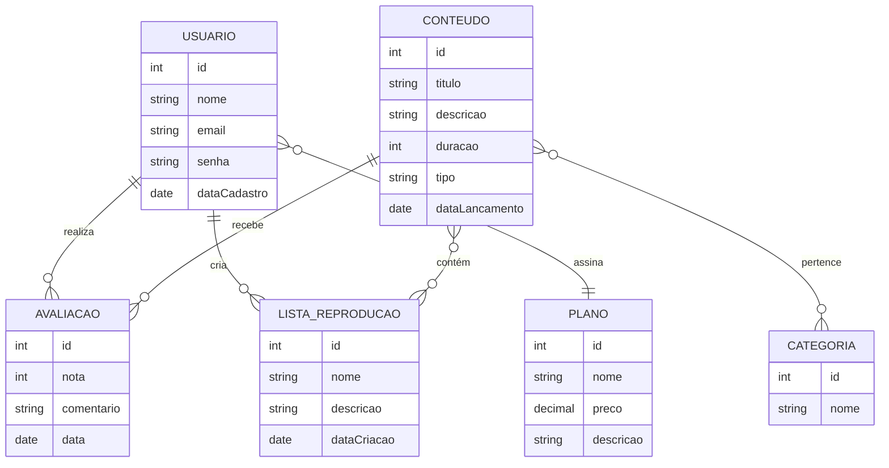

# 🧠 Pensando Sistematicamente: Planejando o Banco de Dados para o PI

---

## 🎯 Objetivos da Aula

* Desenvolver **visão sistêmica** no planejamento de sistemas.
* Aprender a **mapear entidades, atributos e relacionamentos**.
* Criar o **modelo conceitual (DER)** para o Projeto Integrador (PI).

---

## 🚀 1. O que é Pensar Sistematicamente?

* Antes de criar tabelas ou escrever SQL, precisamos **enxergar o sistema como um todo**.
* Um sistema é formado por **usuários, ações e dados**.
* Perguntas que ajudam:

  * Quem são os **usuários**?
  * O que eles **fazem**?
  * Quais **informações** precisamos guardar para isso funcionar?

💡 **Exemplo:** Netflix não começou criando “tabela de filmes”, mas pensando:

* Usuário → pesquisa → assiste → salva favoritos → recebe recomendações.

---

## 📝 2. Exercício Rápido – Brainstorm

👉 Em grupos, respondam:

* Quem são os usuários do sistema?
* Quais ações eles realizam?
* Que dados são necessários para cada ação?

📌 Façam isso em post-its ou no caderno.   
🔑 Isso gera candidatos a **entidades e atributos**.

---

## 🎬 3. Exemplo – Sistema de Streaming

Para entender melhor, vamos pensar em um sistema como a Netflix.

### **Entidades Principais:**

* Usuário 👤
* Plano 💳
* Conteúdo (Filme/Série) 🎥
* Categoria 🏷️
* Avaliação ⭐
* Lista de Reprodução 📂

---

### **Relacionamentos:**

* Usuário **assina** Plano
* Usuário **avalia** Conteúdo
* Conteúdo **pertence** a Categoria
* Usuário **cria** Lista de Reprodução
* Lista de Reprodução **contém** Conteúdo

---

## 🔎 Modelo Conceitual (DER)

---

### **Atributos:**

* **Usuário:** id, nome, email, senha, dataCadastro
* **Plano:** id, nome, preço, descrição
* **Conteúdo:** id, título, descrição, duração, tipo, dataLançamento
* **Categoria:** id, nome
* **Avaliação:** id, nota, comentário, data
* **Lista de Reprodução:** id, nome, descrição, dataCriação

---

## 🛠️ 4. Atividade Prática – Seu Projeto Integrador

1. Descreva o **fluxo do sistema** (entrada, ações, saída).
2. Liste **usuários e suas ações**.
3. Identifique **entidades e atributos**.
4. Crie o **DER conceitual** do sistema.

📌 Entrega: DER finalizado para feedback.

---

## ✅ 5. Fechamento

* Veremos exemplos de DERs dos grupos.
* Boas práticas:

  * Evitar atributos desnecessários.
  * Pensar em relacionamentos antes de tabelas.
  * Reutilizar entidades quando possível.
